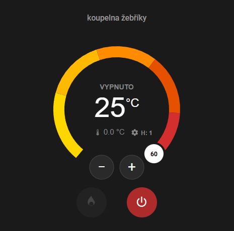

#Kkroky pro přidání mé vlastní karty termostatu pro užití 2 Terma Moa Blue tyčí#  
#Steps to adding my custom thermostat card for using 2 pcs. of Terma Moa Blue heating elements#

**1) přidat soubor "koupelna-thermostat-card.js" do složky WWW vaší instance HA**  
*Add the file koupelna-thermostat-card.js to the WWW folder of your HA instance."*

**2) přidat nastavení (pomocníky) do konfiguračního souboru Home Assitantu "configuraiton.yaml"**  
*Add settings (helpers) to the Home Assistant configuration file "configuration.yaml"*

**3) přidat nastavení do konfiguračního souboru Home Assistantu "automations.yaml"**  
*Add settings to the Home Assistant configuration file "automations.yaml"*

**4) provést restart Home Assistantu (nikoli rychlý restart)**  
*restart Home Assistant (not a quick restart)*

**5) Přdání karty termostatu na kartu:**  
- na zvoleném místě dashboardu kliknout "přidat kartu"
- scrollovat až dolů a vybrat "manuální"
- v okně pro yaml kód vše smazat a vložit tento kód:
```
type: custom:koupelna-thermostat-card
name: koupelna žebříky
```

*Adding a thermostat card to the card:*  
*- Click "Add card" in the selected location on the dashboard.*  
*- Scroll down and select "Manual."*  
*- Delete everything in the YAML code window and paste this code:*  
```
type: custom:koupelna-thermostat-card
name: koupelna žebříky

```
